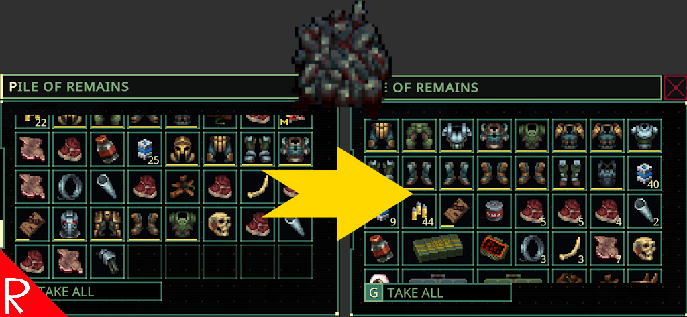

# Storage Sort, Drop, and Single Drop



# Docs

Features:
* Adds sort the many of the inventory screens in raid and in space.  Defaults to S.
* Adds a Drop All hotkey to containers and corpses.  Defaults to D.
* Adds the context menu command "Drop One".

Each feature can be disabled in the configuration by setting the key to None.

The drop all key is useful when dropping gas from barrels in one keystroke.

The "Drop One" command is useful when dropping a single item from a stack to keep a door open.  For example, a piece of plastic.

The keys can be configured using the Mods button on the main screen or directly in the config file.

# "Drop One" and Context Menu Hotkeys Mod
To add a hotkey to the "Drop One" function in the Context Menu Hotkeys mod, 

Add this to the list of keys in the Context Menu Hokeys config file:

```json
    {
      "Key": "F",
      "Command": 620000
    },

```

The above will add the key F as the hotkey when the context menu is open.

# Configuration

The configuration file will be created on the first game run and can be found at `%AppData%\..\LocalLow\Magnum Scriptum Ltd\Quasimorph_ModConfigs\StorageSort\config.json`.

|Name|Default|Description|
|--|--|--|
|SortKey|S|The key that sorts the current storage inventory when in a raid.|
|BackpackSortModifierKey|None|The key to hold down while pressing the 'Sort Key' to sort the player's backpack instead of a container. Set to None to not require a modifier key. This currently only works when in a raid.|
|SpaceSortKey|S|The key that sorts the current storage inventory when in space.|
|DropKey|D|Drops all items in a container.|

## Key List
The list of valid keyboard keys can be found at the bottom of https://docs.unity3d.com/ScriptReference/KeyCode.html
Beware that numbers 0-9 are Alpha0 - Alpha9.  Most of the other keys are as expected such as X for X.
Use "None" to not bind the key.

# Support
If you enjoy my mods and want to buy me a coffee, check out my [Ko-Fi](https://ko-fi.com/nbkredspy71915) page.
Thanks!

# Source Code
Source code is available on GitHub at https://github.com/NBKRedSpy/QM_StorageSort

# Credits
* Special thanks to Crynano for his excellent Mod Configuration Menu. 

# Change Log
## 3.5.0
* Added backpack sort when in space.

## 3.4.0 
* Added "drop all" to corpse items.
* Changed player backpack sort to not require modifier key by default.
* Fix for keys conflicting with open context menu.

## 3.3.0 
* Fixed Drop One command not using an AP like what the game's Drop command does.

## 3.2.0
* 0.9.7+ Only
* Added ability to sort the player's backpack when in raid.

## 3.1.0 
* 0.9.7+ Only
* Added MCM support for key binding.
* Fix for sort key invoked while in space.  Missed in previous update.
* Internal - Upgraded MCM configuration and all related requirements to the latest versions.

## 3.0.1
* 0.9.7+ Only
* Fix for sort key invoking when not focused.

## 3.0.0
* Added space cargo screen sort.  This functionality was previously available via the Sort To Tabs mod; However, the game now has a cargo distribution ability and that mod has been decommissioned.
